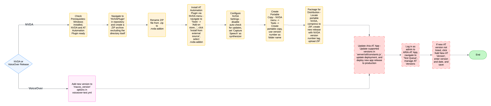

# Adding AT Automation Versions

This document describes the process for adding a new version of an AT to the ARIA-AT App. These instructions will be used for both NVDA and VoiceOver.

## NVDA

### Prerequisites

- Local system must be running Windows
- Install NVDA on your local system
- Download the NVDA AT Automation plugin from [Prime-Access-Consulting/nvda-at-automation](https://github.com/Prime-Access-Consulting/nvda-at-automation)

### Prepare the AT Automation Plugin

1. Navigate to the "NVDAPlugin" directory in the PAC nvda-at-automation repository
2. Create a ZIP archive containing all of the files inside the NVDAPlugin directory including:
   - globalPlugins directory
   - synthDrivers directory
   - manifest.ini file

> **Note:** Do not include the "NVDAPlugin" directory itself in the ZIP

3. Rename the ZIP file extension from .zip to .nvda-addon

### Install and Configure NVDA

1. Install the AT Automation plugin:
   - Open NVDA menu (NVDA+N or via System Tray)
   - Navigate to "Tools" -> "Add-on store..."
   - Click "Install from external source"
   - Select your .nvda-addon file
2. Configure NVDA Settings (NVDA+N -> Preferences -> Settings):
   - General: Disable "Automatically check for updates"
   - General: Disable "Notify for pending update on startup"
   - Speech: Set "Capture Speech" as the active synthesizer
   - Verify the AT Automation plugin is loaded and enabled

### Create Portable Copy

1. Open NVDA menu (NVDA+N or via System Tray)
2. Navigate to Tools -> Create portable copy
3. For the folder name, use the version number from NVDA's about screen (e.g., "2024.4.1")
4. Enable the "Copy current user configuration" checkbox
5. Create the portable copy

### Package for Distribution

1. Locate the portable NVDA folder you just created
2. Right-click the folder and use "Compress to ZIP file" option
3. Create a new release for [aria-at-automation-nvda-builds](https://github.com/bocoup/aria-at-automation-nvda-builds):
   1. Click "Create new release"
   2. For the tag and release title, use the NVDA version number
   3. Upload the ZIP file to the release

## VoiceOver

1. Add the newly available version to the `options` for `macos_version` in [aria-at-gh-actions-helper/.github/workflows/voiceover-test.yml](https://github.com/bocoup/aria-at-gh-actions-helper/blob/main/.github/workflows/voiceover-test.yml)
   1. Note that a separate workflow exists to support `macos_version=15` in [aria-at-gh-actions-helper/.github/workflows/self-hosted-macos-15.yml](https://github.com/bocoup/aria-at-gh-actions-helper/blob/main/.github/workflows/self-hosted-macos-15.yml)

## Update Aria-AT App

Note that these steps are required for both NVDA and VoiceOver

1. Update the supported versions constant in the aria-at-app:
   - `AT_VERSIONS_SUPPORTED_BY_COLLECTION_JOBS` in [server/util/constants.js](https://github.com/w3c/aria-at-app/blob/development/server/util/constants.js#L4)
2. Update the relevant deployment
3. Create and deploy a new release of the aria-at-app to production
4. Log in to the ARIA-AT App as an administrator
5. Navigate to the "Test Queue" page
6. Click "Manage Assistive Technology Versions"
7. If the new AT version is not listed:
   1. Click "Add New AT Version"
   2. Enter the version number and available date
   3. Save the new version

The new AT version is now fully configured and ready for use in ARIA-AT App.
